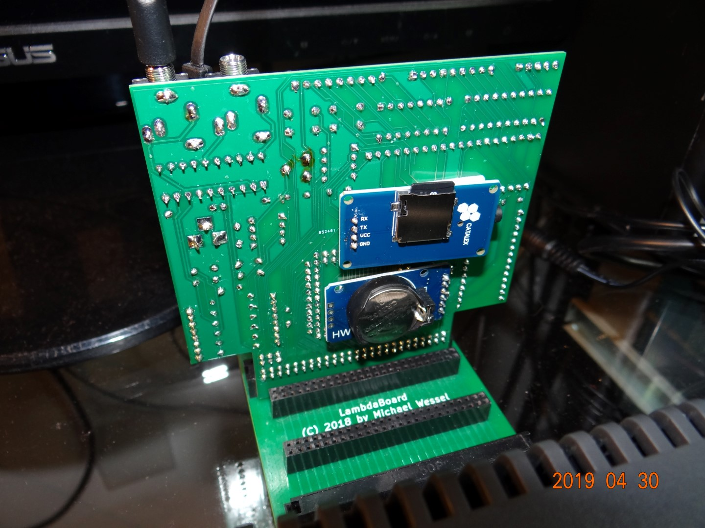

# LambdaSpeak 3
## A Modern-Vintage Speech Synthesizer, PCM Sample Player, Drum Computer, Serial Interface, MP3 Player, and Real Time Clock for the Amstrad / Schneider CPC  
#### Hardware Design & LambdaSpeak Firmware: [Michael Wessel](https://www.michael-wessel.info/) 
#### LambdaSpeak CPC ROM and RSX: [Dr. Stefan Stumpferl]() 
#### Technical Guidance: Bryce (from the CPC Wiki Board) 
#### Additional Ideas: Zhulien (from the CPC Wiki Board) 
#### License: GPL 3

### Introduction

LambdaSpeak 3 is a versatile hardware extension for the Amstrad / Schneider CPC 464 (Plus), 664, and 6128 (Plus) home computer, with a focus on speech synthesis and PCM sample playing. 

It offers:

  1. **DECtalk-based Text-to-Speech (TTS) synthesis:** the **Epson S1V30120 TTS** chip on the utilized mikroBUS "TextToSpeech Click!" daughterboard from MikroElektronika implements DECtalk v5 -- a natural sounding speech synthesizer for English and Spanish, with different voices. DECtalk can even sing. The DECtalk mode is very powerful and versatile, but can the DECtalk control language can be difficult to program. Hence, a simplified control language for the S1V30120 is offered as well, the so-called Epson mode. The DECtalk mode is used to implement two Amstrad CPC specific modes: LambdaSpeak offers a DECtalk-based emulation of the Amstrad SSA-1 Speech Synthesizer, and an emulation of the DK'tronics Speech Synthesizer as well. These retro speech synthesizers from ~ 1985 used the SPO256-AL2 from General Instruments. The emulation is faitful enough such that software that supports these speech synthesizers (e.g., Games such as "Roland In Space" from Amsoft) works. However, the speech is different from original SPO256-AL2. For higher authenticity, LambdaSpeak can optionally be fitted with a SPO256-AL2 as well. 

  2. **Optional GI SPO256-AL2 speech synthesis:** this chip was used in the official Amstrad CPC SSA-1 speech synthesizer as well as the D'tronics speech synthesizer for the CPC. With fitted SPO256-AL2, LambdaSpeak 3 offers a modern re-implementation of these historic speech synthesizers that sound just like the orginals from 1985. 

  3. **PCM Sample Playing Capability / Amdrum emulation:** the Amdrum was a digital sample player / drum computer for the CPC. It consisted of a simple Digital-to-Analog (DAC) converter connected to the CPC databus. Bytes transmitted to the DAC would be turned into PCM audio. Hence, the PCM sample data has to be "streamed" from the CPC over the databus to Amdrum to play a PCM sample. The Amdrum supports 3 channels of 8 Bit audio in a decent quality; the mixing of PCM channels is done in software by the CPC / Z80 though, in realtime, to achieve polyphony. 

  4. **HighQuality Polyphonous Autonomous PCM Sample Playing Capability:** unlike the Amdrum mode, which requires the CPC to send the PCM sammple bytes in realtime over the databus to the Amdrum DAC, this mode offers "autonomous" sample playing. LambdaSpeak 3 is equipped with a 128 KB SPI EEPROM, which serves as a persistent memory for PCM samples. Samples can be uploaded into that memory from the CPC and played back by issuing a commend from the CPC. This mode offers 4 channels of PCM polyphony, and > 16 kHz bandwith. Moreover, since no realtime streaming of PCM sample bytes is required from the CPC for sample playback, PCM sample playback can even be trigger from BASIC. The playback mode offers 1, 2, 3, or 4 channels, and pitch can be controlled to some extent as well. A sample can be as large as 128 KBs. The 8bit PCM quality can be much higher than Amdrum's. 

  5. **An UART / Serial Interface:**  this versatile general purpose UART / Serial Interface offers flexible BAUD rates, 5 to 8 bits per frame, different parity bit and number of stop bit configurations. The UART Interface can either be offered via a PIN header on the LambdaSpeak 3 PCB such that FTDI cables or RS232 TTL serial converters can be attached to it via DuPont cables, or a UART module can be soldered in and flushed´onto the back of the LambdaSpeak 3 PCB. The 4 $ MP3 Module from Catalex is a good choice for such a UART module; it offers MP3 playback from a MicroSD Card. See below.  

  6. **An I2C Interface:** this interface is currently used for a **Real Time Clock (RTC) module**. LambdaSpeak 3 can be fitted with an optional DS3231 RTC module, a 6 $ module. At the time of this writing, the LambdaSpeak 3 firmware only supports this DS3231 RTC, but it is conceivable that other I2C modules will be supported in the future as well. The DS3231 also contains a **Temperature Sensor**. 

### CPC Connection 

LambdaSpeak 3 is a MX4-compatible IO extension board. To connect it to
the CPC, it either requires a cable (edge connector / male Centronics
to 50 pin female IDC connector), or a CPC expansion port extender /
backplane, such as the Mother4X or the LambdaBoard.

LambdaSpeak 3 has an optional barrel jack for a 5 V DC power supply;
center polarity is positive. This should only be used with a
stabilized DC PSU in case the CPC or backplane is incable of providing
enough power for LambdaSpeak 3. 

### Hardware Description

Explanation of LambdaSpeak 3 board components: 

Backside of LamdbaSpeak 3, with Catalex MP3 UART module connected / soldered in, and I2C DSS3231 RTC with buffer battery connected to I2C header: 

LambdaSpeak 3 with LambdaBoard CPC expansion backplane: 

### LambdaSpeak Firmware 

### Software

### Support 

### Acknowledgements 

