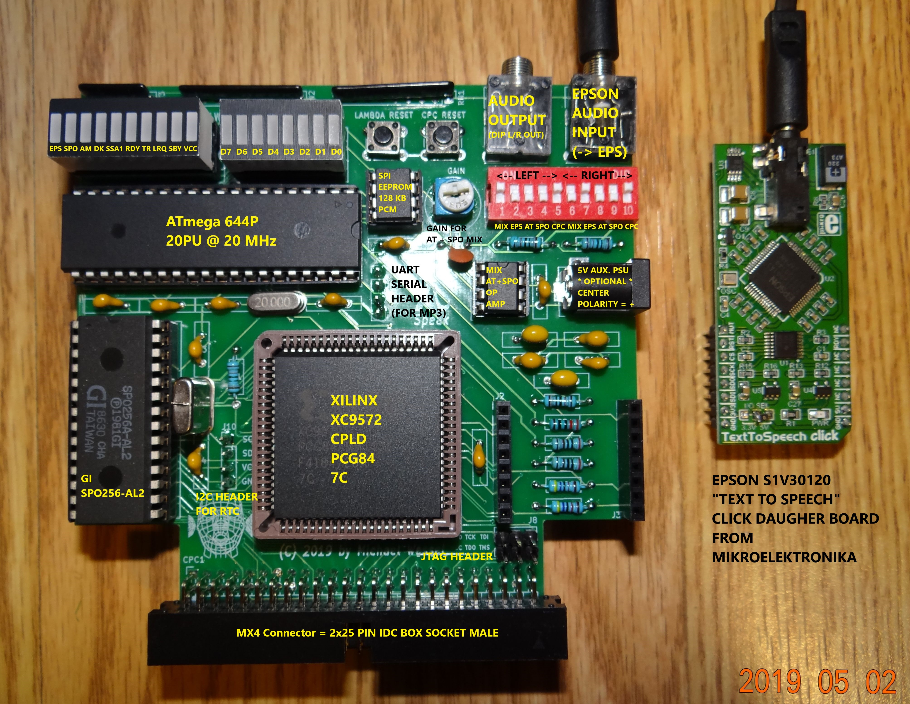
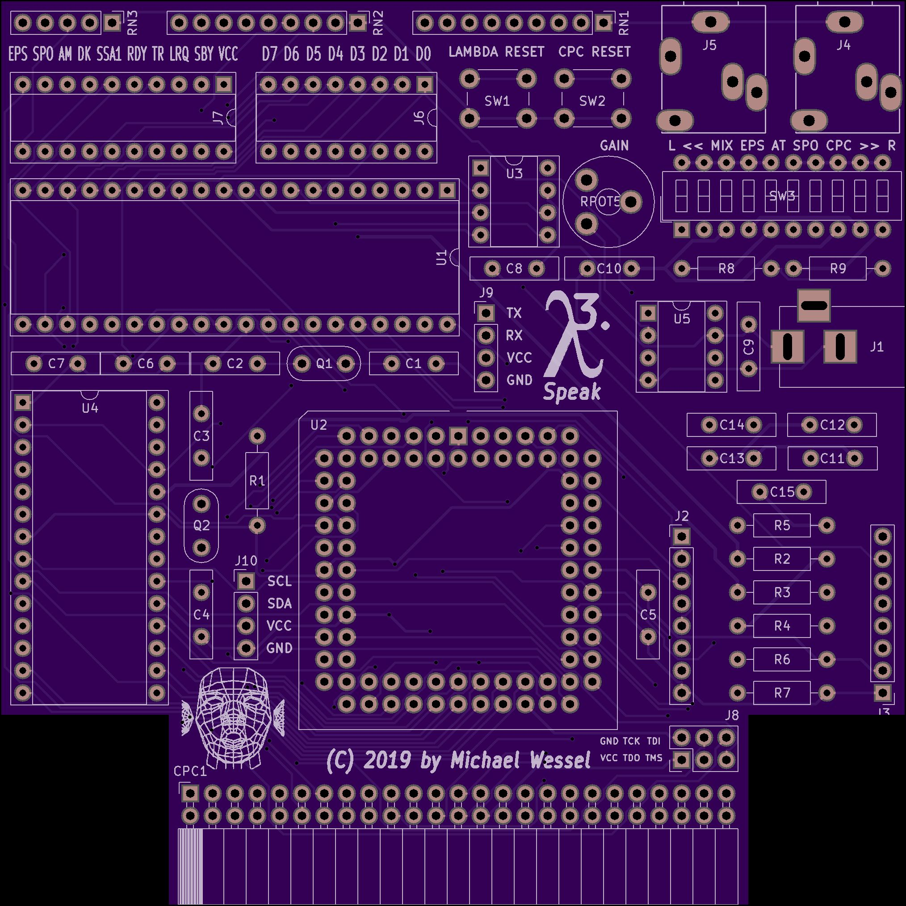
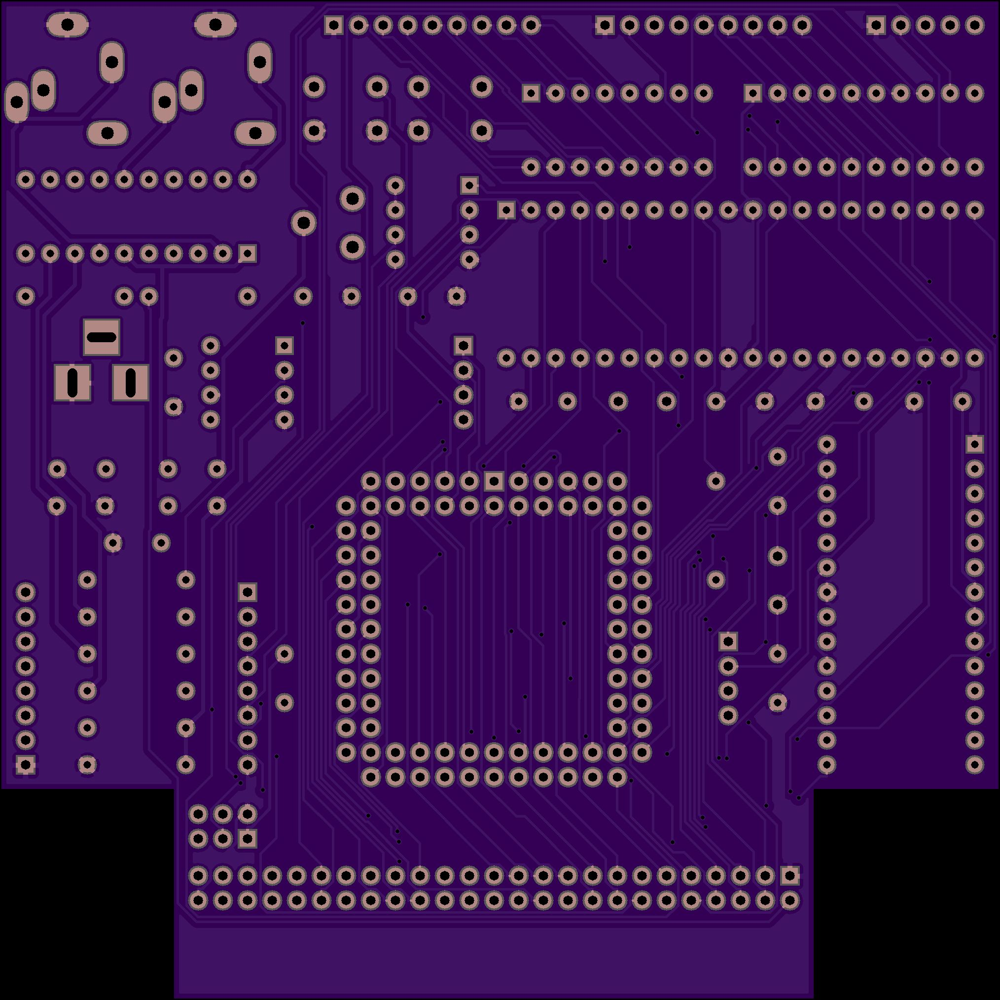
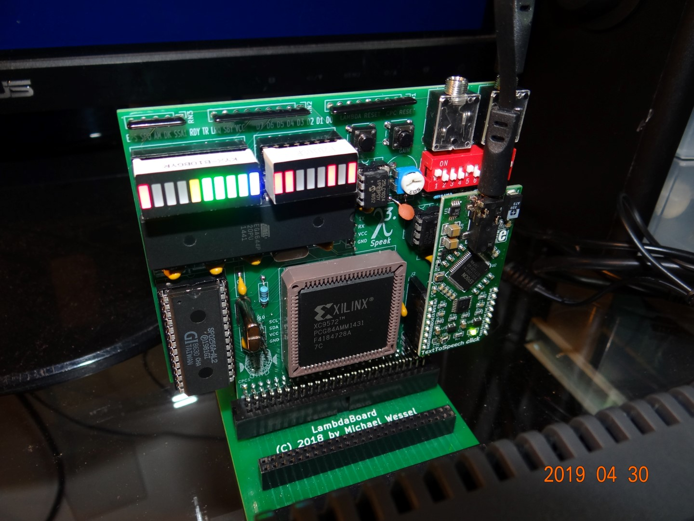

# LambdaSpeak 3
## A Modern-Vintage Speech Synthesizer, PCM Sample Player, Drum Computer, Serial Interface, MP3 Player, and Real Time Clock for the Amstrad / Schneider CPC  
#### Hardware Design & LambdaSpeak Firmware: [Michael Wessel](https://www.michael-wessel.info/) 
#### LambdaSpeak CPC ROM and RSX: [Dr. Stefan Stumpferl]() 
#### Technical Guidance: Bryce (from the CPC Wiki Board) 
#### Additional Ideas: Zhulien (from the CPC Wiki Board) 
#### License: GPL 3

### Introduction

LambdaSpeak 3 is a versatile hardware extension for the Amstrad / Schneider CPC 464 (Plus), 664, and 6128 (Plus) home computer, with a focus on speech synthesis and PCM sample playing. 

It offers:

  1. **DECtalk-based Text-to-Speech (TTS) synthesis:** the **Epson S1V30120 TTS** chip on the utilized mikroBUS "TextToSpeech Click!" daughterboard from MikroElektronika implements DECtalk v5 -- a natural sounding speech synthesizer for English and Spanish, with different voices. DECtalk can even sing. The DECtalk mode is very powerful and versatile, but can the DECtalk control language can be difficult to program. Hence, a simplified control language for the S1V30120 is offered as well, the so-called Epson mode. The DECtalk mode is used to implement two Amstrad CPC specific modes: LambdaSpeak offers a DECtalk-based emulation of the Amstrad SSA-1 Speech Synthesizer, and an emulation of the DK'tronics Speech Synthesizer as well. These retro speech synthesizers from ~ 1985 used the SPO256-AL2 from General Instruments. The emulation is faitful enough such that software that supports these speech synthesizers (e.g., Games such as "Roland In Space" from Amsoft) works. However, the speech is different from original SPO256-AL2. For higher authenticity, LambdaSpeak can optionally be fitted with a SPO256-AL2 as well. 

  2. **Optional GI SPO256-AL2 speech synthesis:** this chip was used in the official Amstrad CPC SSA-1 speech synthesizer as well as the D'tronics speech synthesizer for the CPC. With fitted SPO256-AL2, LambdaSpeak 3 offers a modern re-implementation of these historic speech synthesizers that sound just like the orginals from 1985. 

  3. **PCM Sample Playing Capability / Amdrum emulation:** the Amdrum was a digital sample player / drum computer for the CPC. It consisted of a simple Digital-to-Analog (DAC) converter connected to the CPC databus. Bytes transmitted to the DAC would be turned into PCM audio. Hence, the PCM sample data has to be "streamed" from the CPC over the databus to Amdrum to play a PCM sample. The Amdrum supports 3 channels of 8 Bit audio in a decent quality; the mixing of PCM channels is done in software by the CPC / Z80 though, in realtime, to achieve polyphony. 

  4. **HighQuality Polyphonous Autonomous PCM Sample Playing Capability:** unlike the Amdrum mode, which requires the CPC to send the PCM sammple bytes in realtime over the databus to the Amdrum DAC, this mode offers "autonomous" sample playing. LambdaSpeak 3 is equipped with a 128 KB SPI EEPROM, which serves as a persistent memory for PCM samples. Samples can be uploaded into that memory from the CPC and played back by issuing a commend from the CPC. This mode offers 4 channels of PCM polyphony, and > 16 kHz bandwith. Moreover, since no realtime streaming of PCM sample bytes is required from the CPC for sample playback, PCM sample playback can even be trigger from BASIC. The playback mode offers 1, 2, 3, or 4 channels, and pitch can be controlled to some extent as well. A sample can be as large as 128 KBs. The 8bit PCM quality can be much higher than Amdrum's. 

  5. **An UART / Serial Interface:**  this versatile general purpose UART / Serial Interface offers flexible BAUD rates, 5 to 8 bits per frame, different parity bit and number of stop bit configurations. The UART Interface can either be offered via a PIN header on the LambdaSpeak 3 PCB such that FTDI cables or RS232 TTL serial converters can be attached to it via DuPont cables, or a UART module can be soldered in and flushed´onto the back of the LambdaSpeak 3 PCB. The 4 $ MP3 Module from Catalex is a good choice for such a UART module; it offers MP3 playback from a MicroSD Card. See below.  

  6. **An I2C Interface:** this interface is currently used for a **Real Time Clock (RTC) module**. LambdaSpeak 3 can be fitted with an optional DS3231 RTC module, a 6 $ module. At the time of this writing, the LambdaSpeak 3 firmware only supports this DS3231 RTC, but it is conceivable that other I2C modules will be supported in the future as well. The DS3231 also contains a **Temperature Sensor**. 

### CPC Connection 

LambdaSpeak 3 is a MX4-compatible IO extension board. To connect it to
the CPC, it either requires a cable (edge connector / male Centronics
to 50 pin female IDC connector), or a CPC expansion port extender /
backplane, such as the Mother4X or the LambdaBoard.

LambdaSpeak 3 has an optional barrel jack for a 5 V DC power supply;
center polarity is positive. This should only be used with a
stabilized DC PSU in case the CPC or backplane is incable of providing
enough power for LambdaSpeak 3. 

### Hardware Description

#### Explanation of the LambdaSpeak 3 board.  

LambdaSpeak 3 processes 3 or 4 sources of audio. The 10 position DIP switch is used to assign these different sources to either the left or right audio channels of LambdaSpeak's stereo output jack. A source can also be assigned to both left and right. The DIP switches 1 to 4 determine which audio source is routed to the left, and the switches 6 to 9 are used to assign the right audio channel of the stereo output jack.  Moreover, the non-plus CPCs also allow to feed back the audio signal into the CPC using the SND pin of the expansion port, and loopback audio signal then gets amplified and routed to the internal speaker of the CPC. This does not work for Plus CPCs though. Hence, switches 5 and 10 can be used to switch on or off the audio feed into the CPC. Otherwise, an external amplifier must be used and connected to LambdaSpeak's stereo output jack. 

The audio sources processed and routed via the the DIP switch are the following. The corresponding labels are printed on the PCB; see picture. **Please note that there should be at most one audio signal routed to the left output channel, and at most one audio signal routed to the right output channel. It is OK to route one source to both left and right, but one should not route two sources (or more) to the same (left or right) channel!**

From left to right, the DIP switches 1 to 5 and 6 to 10 are: 

  - **MIX (1 = left, 6 = right):** MIX is the output of LambdaSpeak's OP amp. The OP amp is a summing OP amp with Gain control that amplifies and recovers the mono PCM output generated by the ATmega (PCM Sample Playing), and the sound generated by the SPO256-AL2 vintage speech chip. The corresponding DIP switch determines if the OP amp's output is routed to the left and/or right output channel (or turned off completely). Notice that using an OP amp always results in some degradation of the audio quality. Hence, it is also possible to exclusively route the PCM output or exclusively route the SPO256-AL2 output to the left or right channel (see switches SPO and AT below). If no SPO256-AL2 is being used, then there is no need for the MIX output, and the switch should be in the off position. 

  - **EPS (2 = left, 7 = right):** Turn on or off routing of the stereo audio signal received over LambdaSpeak's stereo audio input jack (the right stero jack on the board). Usually, this connects to the output output jack of the Epson click daughter board. The output of the Epson speech board is mono, but heard on the left and right channel. The TTS click daugherboard is already equipped with an audio amplifier, so it also possible to directly connect a loudspeaker or audio amplifier to the audio socket of the daugherboard itself. In the case, LambdaSpeak's stereo input jack is available to receive either the audio output generated by the  CPC, using the audio stereo output jack of the CPC (and left or right channels will be routed accordingly), or to the output of the MP3 module can be used (see below). In any way, the left or right channels will be routed accordingly (i.e., left to left and right to right). Note that EPS input is not amplified by the internal OP amp. 

  - **AT (3 = left, 8 = right):** the raw PCM output from the ATmega; used for the Amdrum mode and the autonomous PCM Sample Playing mode. This signal has higher quality than the MIX output. If no SPO256-AL2 is being used, then there is no need for the MIX output, and the AT raw PCM output achieves higher PCM quality and bandwidth. 

  - **SPO (4 = left, 9 = right):** the raw speech output from the optional SPO256-AL2 chip; used for the SPO-based SSA1 and DKtronics modes. This signal has higher quality than the MIX output. If no SPO256-AL2 is being used, then this switch should be in the off position. 

  - **CPC (5 = left, 10 = right):** determines if the left (resp. right) output channel of LambdaSpeak's stereo output jack should be routed into the CPC's internal audio amplifier and speaker. Please note that the assignment of the left and right output of LambdaSpeak's stereo jack is determined by the DIP switches 1 to 5, and 6 to 9, resp., as just explained. This does not work on the Plus line of CPC computers, so these switches should be in the off position for a CPC Plus computer. 
 
A *reasonable default configuration* for a LambdaSpeak 3 *with SPO256-AL2* is `10001-01001`. Hence, MIX on the left output channel, and Epson speech on the right output channel. Moreover, both are being heard in the CPC's internal speaker as well, so no need for an external amplifier. 

A *reasonable default configuration* for a LambdaSpeak 3 *without SPO256-AL2* is `00101-01001`. Hence, raw ATmega PCM audio on the left channel, and Epson speech on the right. Moreover, the CPC speaker is turned on. 

A *reasonable default configuration* for an Amdrum / PCM Sample Playing session could be `00101-00101`. Hence, raw ATmega PCM audio on the left and right channel, and no speech output at all. However, an extra cable and external mixer and amplifier or dedicated loudspeaker could still be used for Epson speech (use the daugherboards own stero jack). 

The **10 LED segment bar on the left** is used to indicate the current
mode / status of LambdaSpeak 3. The LEDs have the following meaning:

  - **VCC:** Power LED. 
  - **SBY:** If fitted with a SPO256-AL2, the status of the SBY pin ("Standby"). 
  - **LRQ:** If fitted with a SPO256-AL2, the status of the LRQ pin ("Load Request"). 
  - **RDY**: Mostly used to indicate that LambdaSpeak is ready to accept input; however, the LED is also used for other purposes.
  - **TR**: Mostly used to indicate that LambdaSpeak is transmitting data to the the Epson daughterboard (that it is speaking); however, the LED is also used for other purposes.  
  
  - the other LEDs **EPS, SPO, AM, DK, SSA1** are used to indicate the current mode. 

    ---------------------------------------------------------------------------
    | EPS | SPO | AM  | DK  | SSA1 | Mode                | To Enter | To Quit | 
    |-----|-----|-----|---- |------|---------------------|----------|---------|
    |     |     |     |     |      | Serial Mode / UART  |    F1    |  FF,14  | 
    |  X  |     |     |  X  |   X  | Native Epson        |    EF    |         |
    |  X  |     |     |     |      | Native DECtalk      |    EE    |         |
    |  X  |     |     |     |   X  | SSA1 Emulation      |    ED    |         | 
    |  X  |     |     |  X  |      | DKtronics Emulation |    EC    |         | 
    |     |  X  |     |     |   X  | SSA1 SPO            |    E2    |         | 
    |     |  X  |     |  X  |      | DKtronics SPO       |    E1    |         |
    |     |     |  X  |     |      | Amdrum Emulation    |    E3    | PC      |
    |     |     |  X  |  X  |   X  | EEPROM PCM Upload   |    FE    | EOO RB  | 
    |     |  X  |  X  |  X  |   X  | EEPROM PCM Play     | FA .. FD | RB      | 
    ---------------------------------------------------------------------------

    These different modes are going to explained in more detail in the subsequent sections. 

The **8 LED segment bar on the right** is used to indicate the current / last byte transmitted from the CPC to LambdaSpeak (the last databus byte latched from IO port &FBEE). Each `out &fbee,<byte>` BASIC command will show the `<byte>` in binary on the LED segment. Moreover, by removing the LED segment bar from its socket, the socket can be used as General Purpose Digital Output controller by the CPC; for example, a 8-Relay Module can be driven by these outputs to control home appliances or other devices from the CPC. It is not possible to do General Purpose Digital Input over these ports, but the CPC's joystick port could be used for that purpose. 

#### Overview of LambdaSpeak 3 Modes 

Referring to the table above, the EEPROM PCM Play mode is the
autonomous PCM sample playback mode. Since this mode can also involve
the SPO256-AL2 using Channel 10, the SPO LED is being lit in this mode
as well. Moreover, to upload the PCM samples from the CPC into
LambdaSpeak's EEPROM, the EEPROM PCM Upload mode is being used:

LambdaSpeak 3 is controlled by sending "control bytes" or "commands" -
the different modes are enable and disabled by sending control
bytes. In normal operation mode (i.e., the standard dispatcher loop is
running), each byte being sent to IO port `&FBEE` > 127 is considered
a control byte. All bytes < 128 are considered as content (phonemes,
text, ...) for the speech synthesizer. This is the behavior of
LambdaSpeak's normal control byte dispatcher / main mode listener
loop.

Moreover, the **Serial Mode / UART** has its own command dispatcher /
listener loop, and follows different conventions. See below for an
explanation of the Serial Mode. Other modes, such as the Amdrum
Emulation mode, also do not interpret control / command bytes (each
byte is considered a PCM sample).

In addition, there are "sub" modes for setting the RTC (Real Time
Clock) time and calendar. These modes do not have a dedicated LED
pattern. Normal operation is resumed after the clock (resp. calendar)
has been set. To set the time, invoke control byte / command `&DB`,
and then send the hours, minutes, and seconds to the databus (port
`&FBEE`), one byte at a time. Likewise, to set the calendar, invoke
control byte `&DA`, and then send the year, month, date, and weekday
(1 to 7 for Monday to Sunday) on the databus, one byte at a time. The
set time and set calendar sub modes are 'modal' in the sense that
normal operation of LambdaSpeak 3 is suspended until all requested
parameters have been received. While the set time and set date
commands are still requesting parameters, normal control byte
dispatching is disabled, and LambdaSpeak returns to normal behavior
(hence exiting the modal "sub" mode) after the clock (resp. calendar)
has been set. There is no special LED pattern to indicate these set
time and set calendar "sub" modes.

Another sub mode is the *echo test program* which runs an echo program
of `&FBEE` until reset button or power cycle (see below).

Note that, in the table above, `PC` stands for Power Cycle - the only
way of quitting the Amdrum mode is to power cycle the CPC (and
LambdaSpeak). This is of course always an option to quit any of the
listed modes, but the Amdrum mode it is the only way of quitting
it. `EOO` stands for `end of operation`; this means that normal control byte
/ command dispatching is resumed after all requested bytes have been
received. `RB` stands for the LambdaSpeak Reset Button -- with the
exception of the Amdrum mode, the Reset Button is of course always an
option to leave the current mode, but it is listed for a mode in the
table above if there is no other way of quitting this mode.
    

#### Schematics 

 
[Click here for a PDF version of the schematics.](schematics/schematics.pdf) 

#### Printed Circuit Boards

 
 
 
[Gerbers can be found here.](gerbers/lambdaspeak30-final.zip) 

A version is also hosted on the [Seeed Gallery for immediate ordering PCBs.](https://www.seeedstudio.com/LambdaSpeak-3-g-1230571)

### Bill of Material 

Please note that the resistor networks (`RN1`, `RN2`, `RN3`) are 1k Ohm. All other values can be found in the BOM: 

 

 

#### Some Pictures 

Final breadboard prototype: 

First PCB with additional RTC and MP3 module add after LambdaSpeak 3.0 was already completed, and Zhulien from the CPC Wiki Forum had suggested to add the MP3 module (and I also added the I2C RTC): 

Final version of LambdaSpeak 3: 

Backside of LamdbaSpeak 3, with Catalex MP3 UART module connected / soldered in, and I2C DSS3231 RTC with buffer battery connected to I2C header: 

LambdaSpeak 3 with LambdaBoard CPC expansion backplane: 

### The Modes of LambdaSpeak 3 and the LambdaSpeak Firmware 

#### Native Epson Mode

#### Native DECtalk Mode

#### DECtalk-based SSA1 Mode (SSA1 Emulation)

#### DECtalk-based DK'tronics Mode (DKtronics Emulation) 

#### Authentic SPO256-AL2-based SSA1 Mode (SSA1 Re-Implementation)

#### Authentic SPO256-AL2-based DKtronics Mode (DKtronics Re-Implementation)

#### Amdrum Mode (Amdrum Emulation) 

#### Autonomous PCM Upload Mode (EEPROM PCM Upload Mode) 

#### Autonomous PCM Playback Mode (EEPROM PCM Play Mode) 

#### Serial Mode (UART Mode) 

##### The 4 $ Catalex MP3 Module 

#### I2C Mode 

##### The 6 $ DS3231 RTC (Battery Buffered Real Time Clock) 

### Software

There are a couple of demo programs. 

### Support & Prices 

### Acknowledgements 

